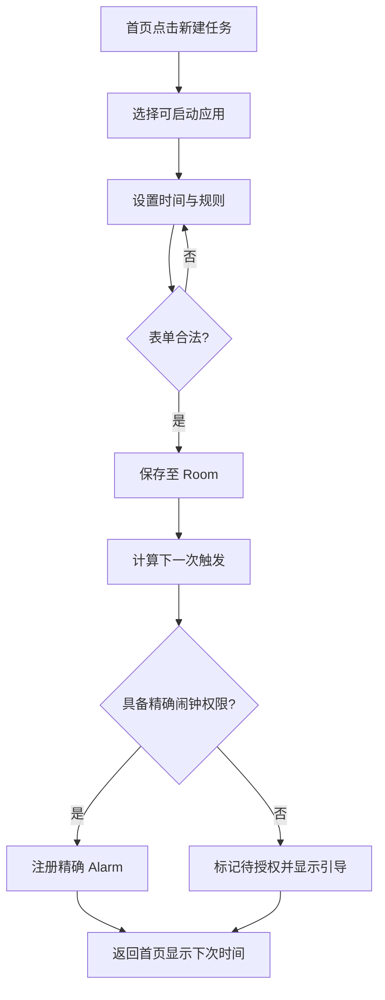
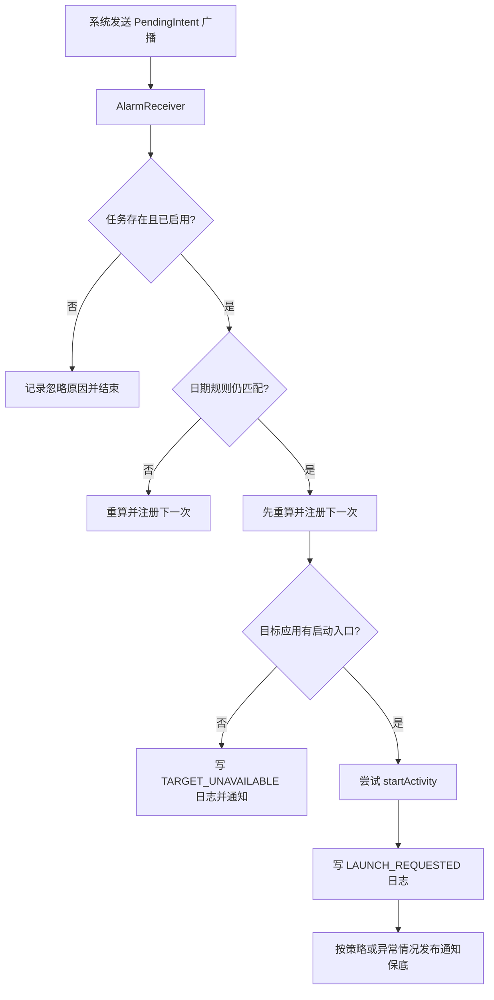
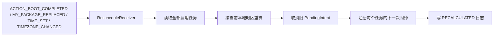
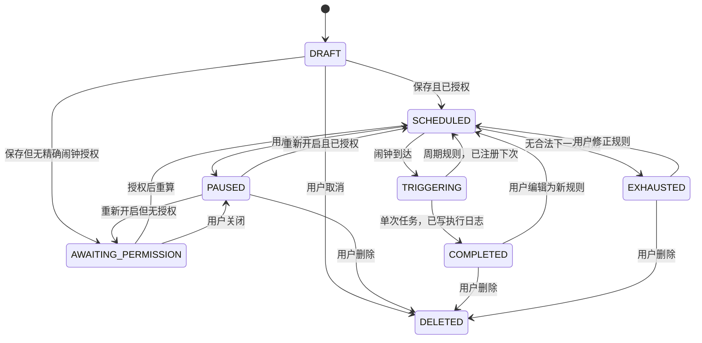

# 用户流程、业务流程与状态机

## 1. 创建任务流程

## 2. 闹钟执行流程

## 3. 重启与时间变化恢复

`BOOT_COMPLETED` 不是绝对可靠：处于受限状态的 Android 13+ 应用可延迟收到该广播。因此首页启动时也必须执行一次全量重算。

## 4. 单任务状态机

## 5. 执行结果状态

| 结果 | 含义 |
|---|---|
| `LAUNCH_REQUESTED` | 已调用系统启动请求；不能证明目标界面可见。 |
| `NOTIFICATION_POSTED` | 已发送用户点击可打开的保底通知。 |
| `SKIPPED_BY_RULE` | 触发时规则不再匹配，例如调休资料更新。 |
| `TARGET_UNAVAILABLE` | 包被卸载、禁用或没有启动 Activity。 |
| `EXACT_ALARM_DENIED` | 没有精确闹钟授权，未登记精确闹钟。 |
| `SCHEDULING_ERROR` | AlarmManager 或 PendingIntent 操作异常。 |
