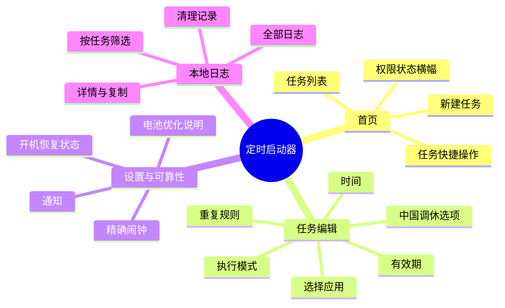

# 信息架构与低保真原型

## 1. 信息架构（脑图）



## 2. 导航规则

| 来源 | 去向 | 返回行为 |
|---|---|---|
| 首页 FAB | 新建任务 | 保存回首页；取消直接返回。 |
| 首页任务卡片 | 编辑任务 | 删除后回首页；保存后刷新卡片。 |
| 编辑页应用行 | 应用选择页 | 选择后回编辑页并填充。 |
| 首页权限横幅 | 设置与可靠性 | 从系统设置回来后在 `onResume` 刷新。 |
| 设置页日志入口 | 日志页 | 保留上次筛选条件。 |

## 3. 首页线框图

```text
┌──────────────────────────────────────┐
│ 定时启动器                     ⋮      │
│ [ ! 精确闹钟未授权，前往设置 ]        │
├──────────────────────────────────────┤
│ ┌──────────────────────────────────┐ │
│ │ [图标] 企业微信              [开] │ │
│ │        工作日 · 18:00             │ │
│ │        下次：今天 18:00            │ │
│ │        ⚠ 系统可能限制后台打开      │ │
│ └──────────────────────────────────┘ │
│ ┌──────────────────────────────────┐ │
│ │ [图标] 钉钉                  [关] │ │
│ │        每天 · 08:30               │ │
│ │        已暂停                      │ │
│ └──────────────────────────────────┘ │
│                                      │
│                            [＋ 新建] │
└──────────────────────────────────────┘
```

### 首页空状态

```text
┌──────────────────────────────────────┐
│ 定时启动器                     ⚙      │
│                                      │
│              ◷                       │
│          还没有定时任务               │
│     新建一个任务，在指定时间尝试打开应用│
│                                      │
│             [ 新建第一个任务 ]         │
└──────────────────────────────────────┘
```

## 4. 新建/编辑任务线框图

```text
┌──────────────────────────────────────┐
│ ‹ 新建任务                            │
├──────────────────────────────────────┤
│ 要启动的应用                           │
│ [ 图标  企业微信              > ]      │
│                                      │
│ 时间                                  │
│ [            18 : 00             ]    │
│                                      │
│ 重复                                  │
│ [ 工作日                         > ]   │
│                                      │
│ □ 按中国法定节假日与调休执行            │
│                                      │
│ 执行方式                               │
│ ● 尝试启动，必要时通知提醒              │
│ ○ 仅通知我点击打开                     │
│                                      │
│                  [ 保存任务 ]          │
└──────────────────────────────────────┘
```

## 5. 设置与可靠性线框图

```text
┌──────────────────────────────────────┐
│ ‹ 设置与可靠性                         │
├──────────────────────────────────────┤
│ 精确闹钟                  未授权  >   │
│ 通知权限                  已授权  >   │
│ 电池优化                  默认优化 >   │
│                                      │
│ 提示：后台启动应用可能被系统拦截。       │
│ 本应用会记录执行请求并提供通知保底。     │
│                                      │
│ 本地日志                         >    │
│ 关于                                 │
└──────────────────────────────────────┘
```

## 6. 可访问性与文案

- 所有图标按钮均有 `contentDescription`。
- 任务开关的语义包含应用名，例如“关闭企业微信的工作日 18:00 任务”。
- 状态不只依赖颜色；使用文本和图标共同表达。
- 时间在视觉上使用 24 小时制，读屏文案为“十八点零分”。
