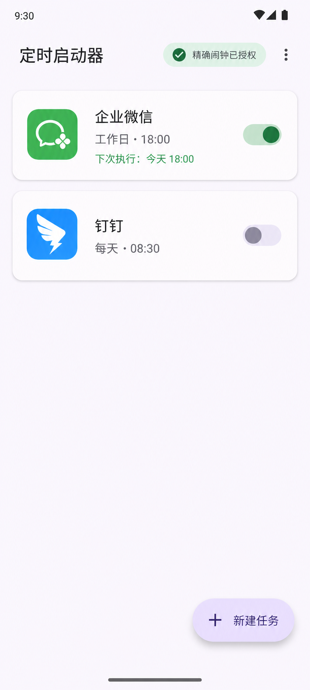

# 高保真 UI 设计稿与设计规范（Design System）

## 1. 视觉方向

采用 Jetpack Compose Material 3，支持浅色、深色和 Android 动态取色。风格是安静、有节奏感的个人工具：时间是主视觉，状态是次视觉，管理操作退到第三层。

核心原则：

- 首屏只回答两件事：**下一次何时执行**、**是否能可靠执行**。
- 用大字号时间、低海拔圆角容器建立层级；避免仪表盘式的过量信息。
- 任一可点击区域不小于 `48 × 48 dp`；启停状态不能仅依赖颜色，必须伴随文本或位置变化。
- 规则、权限和异常均使用自然语言，避免将内部状态码暴露给用户。

## 2. 首页高保真参考图



该图仅作为布局、层级和氛围参考；企业微信与钉钉图标为视觉示意，工程实现中应使用系统返回的应用图标，不得内置或仿制第三方品牌标识。

## 3. 设计令牌

### 色彩

| Token | 浅色建议 | 用途 |
|---|---|---|
| `primary` | Dynamic `primary` | FAB、主要按钮、活动开关。 |
| `secondaryContainer` | Dynamic `secondaryContainer` | 权限状态 Chip。 |
| `surface` | Dynamic `surface` | 页面与卡片基底。 |
| `surfaceVariant` | Dynamic `surfaceVariant` | 次级容器、分隔。 |
| `error` | Material `error` | 权限拒绝、不可用状态。 |
| `onSurfaceVariant` | Dynamic `onSurfaceVariant` | 辅助信息。 |
| `primaryContainer` | Dynamic `primaryContainer` | “下一次执行”时间卡、启用状态与主操作。 |
| `surfaceContainerLow` | Dynamic `surfaceContainerLow` | 正常任务卡与表单选择项。 |
| `outlineVariant` | Dynamic `outlineVariant` | 轻分隔线、未选中状态。 |

不要硬编码品牌绿色或品牌蓝色；目标 App 图标是唯一允许带有其原始色彩的元素。

### 字体与间距

| Token | 值 | 用途 |
|---|---:|---|
| `displaySmall` | M3 默认 | 空状态标题。 |
| `titleLarge` | M3 默认 | 顶部标题。 |
| `titleMedium` | M3 默认 | 任务名称、设置项。 |
| `bodyMedium` | M3 默认 | 规则、下次执行。 |
| `labelLarge` | M3 默认 | 按钮与 Chip。 |
| 基础间距 | 8 dp | 所有间距是 8 的倍数。 |
| 屏幕左右边距 | 16 dp | 列表、表单、空状态。 |
| 卡片内边距 | 16 dp | 任务卡片。 |
| 最小触控目标 | 48 × 48 dp | 图标、开关、列表项。 |

### 圆角与海拔

| 组件 | 形状 | 海拔 |
|---|---|---:|
| 任务卡片 | `RoundedCornerShape(16.dp)` | 1 dp |
| 权限横幅 | `RoundedCornerShape(12.dp)` | 0 dp |
| FAB | M3 `ExtendedFloatingActionButton` | 3 dp |
| 对话框 | M3 默认 | 6 dp |
| 下一次执行卡 | `RoundedCornerShape(28.dp)` | 0 dp |
| 表单选择行 | `RoundedCornerShape(20.dp)` | 0 dp |

## 4. 组件规范

### 任务卡片 `TaskCard`

必含：应用图标（48 dp）、名称、规则与时间、下次状态、启停开关。点击非开关区域进入编辑；开关立即变更，但失败时回滚并显示 Snackbar。

状态标识：

- `SCHEDULED`：正文“下次：今天 18:00”。
- `AWAITING_PERMISSION`：黄色/错误色图标 + “待授予精确闹钟权限”。
- `PAUSED`：弱化文本 + “已暂停”。
- `COMPLETED`：弱化文本 + “单次任务已完成”。
- `TARGET_UNAVAILABLE`：错误图标 + “目标应用不可用”。

卡片结构（从上到下）：

1. 应用图标占位 / 系统图标、应用名称、启停开关。
2. 单行规则，如“工作日 · 18:00”。
3. 细分隔或留白后显示“下次：今天 18:00”；点击卡片进入编辑，开关只负责即时启停。

不要把“编辑”“日志”“删除”同时露出在卡片上；编辑由整卡点击进入，日志置于编辑页或溢出菜单，删除放在编辑页底部的危险操作区。

### 表单

- 使用 `TimePickerDialog` 与 `DatePickerDialog`，不要自建滚轮控件。
- 规则选择使用单选 Bottom Sheet；高级参数在选择后渐进展开。
- 保存按钮固定在屏幕底部安全区域上方；字段错误就地显示。

### 通知

频道：`scheduled_launch`；重要性 `HIGH`（仅用户主动创建的时间敏感任务）。标题“到时间了：打开企业微信”，操作按钮“打开”“稍后提醒”。点击“打开”由用户触发 Activity，因此符合后台限制的推荐交互。

## 5. 页面规格

| 页面 | 主组件 | 关键状态 |
|---|---|---|
| 首页 | `LazyColumn`、`TaskCard`、扩展 FAB | 空、加载、权限待处理、正常列表。 |
| 编辑 | `Scaffold`、表单行、底部保存按钮 | 新建、编辑、校验错误。 |
| 应用选择 | `SearchBar`、`LazyColumn` | 无结果、手动包名验证失败。 |
| 日志 | 筛选 Chip、时间线列表 | 无日志、错误详情。 |
| 设置 | M3 `ListItem` | 权限已授权/未授权/系统不可查询。 |

### A. 首页 `HomeScreen`

```text
┌─────────────────────────────────┐
│ 辰启                         2 个任务运行中 │
│ 定时启动器                            │
│                                     │
│  下一次执行                          │
│  18:00                              │
│  ● 企业微信 · 今天 18:00              │
│                                     │
│ 已安排的任务                          │
│ ┌ 企业微信                    [开] ┐ │
│ │ 工作日 · 18:00                   │ │
│ │ 下次：今天 18:00                 │ │
│ └─────────────────────────────────┘ │
│                                     │
│                         [＋ 新建任务]│
└─────────────────────────────────┘
```

- 顶部不是居中标题：左侧放产品身份，右侧用小型状态 Chip 显示运行中数量。
- “下一次执行卡”位于首屏第一个内容位，时间采用 `46 sp` 左右的紧凑大字；无启用任务时替换为“还没有已启用的任务”。
- 有未完成权限时，将权限横幅放在时间卡与任务列表之间，文案为“需要开启精确闹钟权限才能准时执行”，主操作为“去授权”。
- FAB 固定在右下角，滚动不影响；列表底部预留至少 `104 dp`，防止遮挡最后一张卡。

### B. 新建 / 编辑任务 `CreateTaskScreen`

```text
┌─────────────────────────────────┐
│ 新建任务                           取消 │
│                                     │
│ 启动应用                            │
│ ┌ [图标] 企业微信               更改 ┐ │
│                                     │
│ 执行时间                            │
│ ┌ 18:00                      修改时间 ┐│
│                                     │
│ 重复规则                            │
│ ┌ 工作日（周一至周五）              › ┐│
│                                     │
│ ┌───────────────────────────────┐ │
│ │          保存并开启任务          │ │
│ └───────────────────────────────┘ │
└─────────────────────────────────┘
```

- 页面以分组标题 + 大点击行组织，不使用密集的表格边框。
- 时间值使用 `36 sp`；点击整行打开 Material `TimePickerDialog`。规则行打开单选 `ModalBottomSheet`。
- 主保存按钮固定于底部安全区上方，未选择应用时禁用并解释原因；编辑已有任务时按钮文案为“保存修改”。
- 编辑页的最底部显示“执行日志”和红色文字按钮“删除任务”；删除必须二次确认，并允许 Snackbar 撤销。

### C. 执行日志 `ExecutionLogScreen`

- 顶部显示“本地执行日志”，副标题“仅保留最近 30 天”。
- 每条日志以时间线形式展示：左侧状态点，右侧为时间、`已请求启动 / 已打开 / 失败`、详细诊断文字。
- 成功为 `primary` 状态点；权限或目标应用不可用使用 `error`；普通调度信息使用 `onSurfaceVariant`。
- 首次无日志的空状态：标题“还没有执行记录”，说明“任务触发后，这里会显示结果和诊断信息”。

### D. 应用选择与设置

- 应用选择：顶部搜索框，下方显示系统应用图标、名称、包名；包名仅作为第二行辅助信息，不抢占阅读焦点。
- 设置：以权限健康度为第一组；每个项目用状态标签明确显示“已就绪 / 需要操作 / 系统不可查询”。
- “悬浮窗保底”“忽略电池优化”“精确闹钟”均给出一句后果说明与一个明确跳转按钮，避免只把用户送进系统设置。

## 6. 动效与反馈

- 页面转场：Navigation Compose 默认 Material motion。
- 保存成功：返回首页后更新卡片并显示“任务已保存”。
- 删除：先显示撤销 Snackbar（5 秒）；超时后才实际删除数据库记录与闹钟。
- 禁止在闹钟触发时自动弹出应用内 Dialog；使用通知或日志，避免额外后台 UI 干扰。

## 7. 状态与可访问性

| 场景 | 呈现 | 用户动作 |
|---|---|---|
| 无任务 | 低对比空状态插画区 + “新建第一个任务” | 打开新建页。 |
| 无精确闹钟权限 | 首页顶部权限横幅，不隐藏当前任务 | 跳转系统授权页。 |
| 目标应用已卸载 | 任务卡错误状态 + 包名辅助文字 | 更换应用或删除任务。 |
| 调度失败 | 日志保留原始原因；卡片显示简短可行动文案 | 查看日志 / 去设置。 |
| 单次任务完成 | 卡片弱化并标记“已完成” | 复制为新任务或删除。 |

- 文字对比度遵循 WCAG AA；`onPrimaryContainer` 上的正文不得低于 `4.5:1`。
- 不以图标、颜色或开关位置中的任意单一信号表达状态。
- 动效使用 Material 默认时长；尊重系统“移除动画”设置。

## 8. Compose 落地映射

| 设计元素 | Compose 实现 |
|---|---|
| 下一次执行卡 | `Card(colors = CardDefaults.cardColors(containerColor = colorScheme.primaryContainer), shape = RoundedCornerShape(28.dp))` |
| 任务卡 | `Card` + `Switch`；整卡 `clickable`，开关单独处理事件。 |
| 表单选择行 | `ListItem` 或圆角 `Surface`；整行触发选择器。 |
| 权限横幅 | `Surface(color = secondaryContainer)` + CTA `TextButton`。 |
| 底部保存操作 | `Scaffold(bottomBar = …)`，使用 `navigationBarsPadding()`。 |

设计稿的占位应用图标在实现时统一替换为 `InstalledApp.icon`；不在工程资源中放置企业微信、钉钉等第三方图标。
