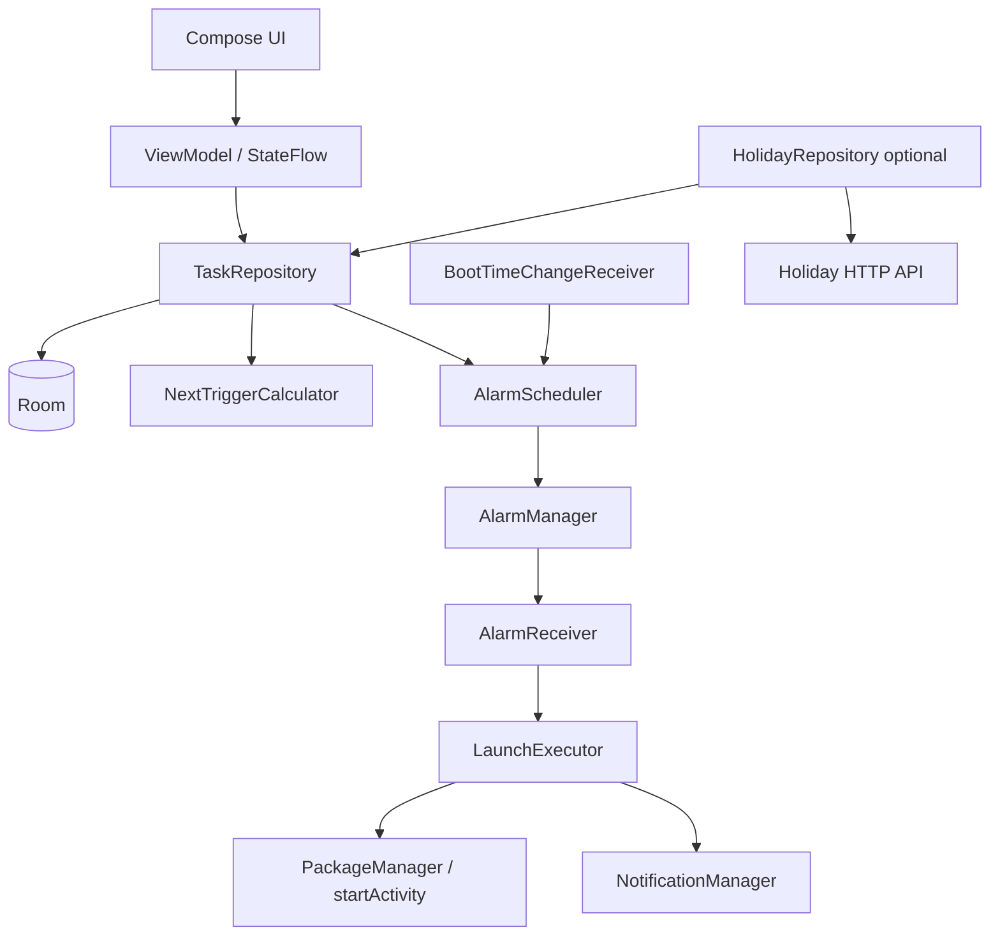
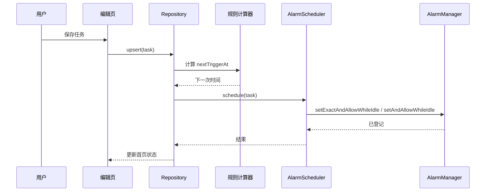

# 系统架构与模块设计

## 1. 架构总览



## 2. 分层职责

| 层 | 组件 | 仅负责 |
|---|---|---|
| UI | Screen、组件、ViewModel | 展示状态、接受用户事件；不直接访问 AlarmManager。 |
| Domain | 规则模型、`NextTriggerCalculator` | 给定规则和当前时间，计算下一次；不依赖 Android UI。 |
| Data | DAO、Repository、DataStore | 持久化与数据组合。 |
| Platform | Scheduler、Receivers、LaunchExecutor | 与 Android 系统服务交互。 |

## 3. 核心接口（Kotlin 伪代码）

```kotlin
interface AlarmScheduler {
    suspend fun schedule(task: ScheduleTask): ScheduleResult
    fun cancel(taskId: Long)
    suspend fun rescheduleAll(reason: RescheduleReason)
}

interface NextTriggerCalculator {
    fun next(task: ScheduleTask, now: ZonedDateTime): NextTriggerResult
}

interface LaunchExecutor {
    suspend fun execute(task: ScheduleTask): LaunchResult
}
```

`ScheduleResult` 与 `LaunchResult` 必须包含结构化状态和面向用户的错误码，不以捕获异常字符串作为 UI 或日志协议。

## 4. 关键时序



## 5. 工程目录

```text
app/src/main/java/com/example/timestart/
├── app/                 # Application、AppContainer
├── data/
│   ├── local/           # Room entity、DAO、database
│   ├── preferences/     # DataStore
│   └── repository/      # TaskRepository、HolidayRepository
├── domain/
│   ├── model/           # ScheduleTask、Rule、结果类型
│   └── scheduling/      # NextTriggerCalculator
├── platform/
│   ├── alarm/           # AlarmScheduler、PendingIntentFactory
│   ├── receiver/        # AlarmReceiver、RescheduleReceiver
│   ├── launch/          # LaunchExecutor
│   └── notification/    # NotificationFactory
└── ui/
    ├── screen/
    ├── component/
    ├── navigation/
    └── theme/
```

## 6. 并发与一致性

- 所有数据库操作在 `Dispatchers.IO`；规则计算为纯函数，可在默认 dispatcher 执行。
- 保存/编辑采用顺序：数据库事务写入 → 取消旧闹钟 → 计算并注册新闹钟 → 更新 `nextTriggerAt` 与状态。
- 执行触发采用顺序：读取任务 → 先注册下一次 → 请求启动目标 → 写执行日志。这样即使启动请求导致进程终止，周期任务仍有后续调度。
- 多个广播同时抵达时按任务 ID 串行化，避免同任务重复登记。

## 7. 故障隔离

- 单一任务的计算/登记异常只写该任务日志，不中止 `rescheduleAll`。
- Receiver 的同步工作保持短小；节假日网络同步只在应用可见时或 WorkManager 的非精确维护任务中完成。
- 启动请求异常仅影响该次执行；任务仍按周期重算下一次。
