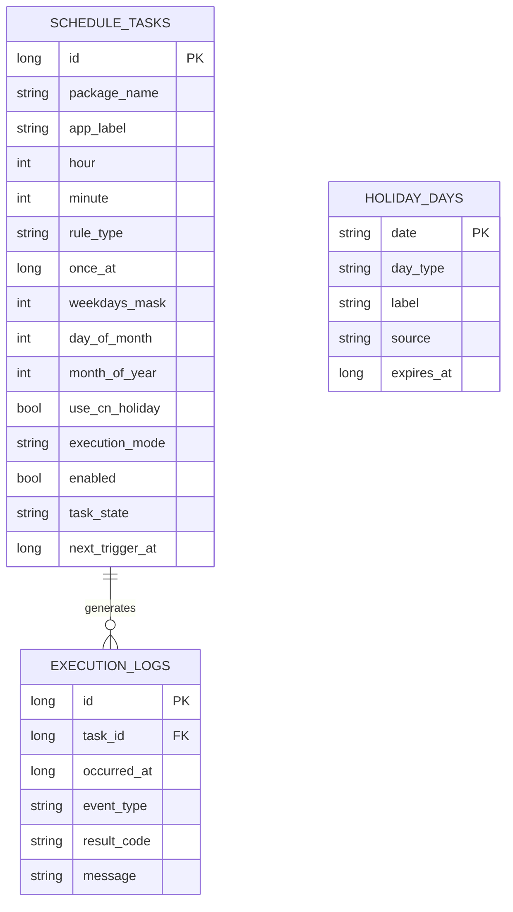

# 数据库设计与 ER 图

## 1. 数据库原则

- 数据库名：`timestart.db`。
- 时间戳统一以 UTC epoch milliseconds 保存；界面以设备当前 `ZoneId` 格式化。
- 规则参数结构化存储，不用难以查询的 JSON 字符串。
- 删除任务采用物理删除；日志保留最多 30 天。

## 2. 表定义

### `schedule_tasks`

| 字段 | Room/SQLite 类型 | 约束与说明 |
|---|---|---|
| `id` | `INTEGER` | PK，自增。 |
| `package_name` | `TEXT` | 非空；目标包名。 |
| `app_label` | `TEXT` | 非空；保存时显示名快照。 |
| `hour` | `INTEGER` | 0–23。 |
| `minute` | `INTEGER` | 0–59。 |
| `rule_type` | `TEXT` | `ONCE/DAILY/WEEKDAY/WEEKEND/WEEKLY/MONTHLY/YEARLY`。 |
| `once_at` | `INTEGER?` | 单次任务的 UTC 时刻。 |
| `weekdays_mask` | `INTEGER?` | bit0=周一 ... bit6=周日。 |
| `day_of_month` | `INTEGER?` | 1–31。 |
| `month_of_year` | `INTEGER?` | 1–12。 |
| `start_date` | `TEXT?` | ISO `yyyy-MM-dd`。 |
| `end_date` | `TEXT?` | ISO `yyyy-MM-dd`。 |
| `use_cn_holiday` | `INTEGER` | 0/1，仅工作日/周末规则适用。 |
| `execution_mode` | `TEXT` | `TRY_LAUNCH_THEN_NOTIFY/NOTIFY_ONLY`。 |
| `enabled` | `INTEGER` | 0/1。 |
| `task_state` | `TEXT` | 状态机状态。 |
| `next_trigger_at` | `INTEGER?` | 下一次计划 UTC 时刻。 |
| `created_at` | `INTEGER` | UTC。 |
| `updated_at` | `INTEGER` | UTC。 |

索引：`idx_tasks_enabled_next(enabled, next_trigger_at)`、`idx_tasks_package(package_name)`。

### `execution_logs`

| 字段 | 类型 | 说明 |
|---|---|---|
| `id` | `INTEGER` | PK，自增。 |
| `task_id` | `INTEGER?` | 关联任务；任务被删除后可为 null。 |
| `occurred_at` | `INTEGER` | UTC。 |
| `event_type` | `TEXT` | 见 [11_本地日志与数据埋点.md](11_本地日志与数据埋点.md)。 |
| `result_code` | `TEXT` | 枚举错误/结果码。 |
| `message` | `TEXT` | 可读短文本，不存堆栈和敏感数据。 |
| `metadata_json` | `TEXT?` | 非敏感诊断字段，如 SDK、规则版本。 |

索引：`idx_logs_task_time(task_id, occurred_at DESC)`、`idx_logs_time(occurred_at DESC)`。

### `holiday_days`

| 字段 | 类型 | 说明 |
|---|---|---|
| `date` | `TEXT` | PK，ISO 日期。 |
| `day_type` | `TEXT` | `WORKDAY/REST_DAY/UNKNOWN`。 |
| `label` | `TEXT?` | 节假日或调休描述。 |
| `source` | `TEXT` | 数据源标识。 |
| `fetched_at` | `INTEGER` | UTC。 |
| `expires_at` | `INTEGER` | UTC。 |

### DataStore 偏好（不入 Room）

`notificationPermissionPrompted`、`lastLogCleanupAt`、`holidayProviderBaseUrl`（如需可配置）、`uiThemeMode`。

## 3. ER 图

## 4. 迁移规则

- 每次 schema 变更必须提供 Room `Migration` 与迁移测试，不允许 MVP 后直接 `fallbackToDestructiveMigration()`。
- 新增非空字段要么给 SQLite 默认值，要么分两次迁移（先可空、回填、再收紧）。
- 数据库版本与变更摘要写入 Git 提交信息和 `CHANGELOG.md`（工程创建后）。
